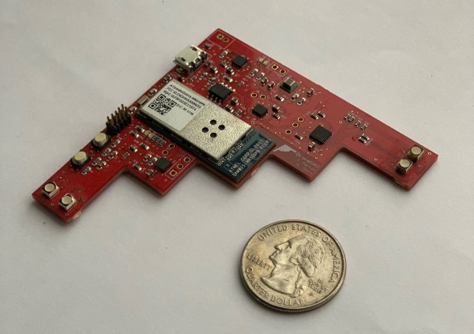
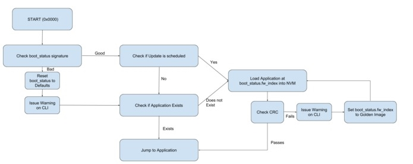
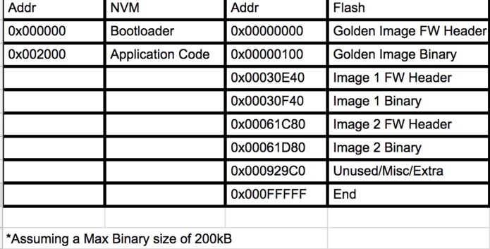

DroneDAD is an IoT device designed from the ground up for ESE516 IoT Edge Computing at University of Pennsylvania. I worked with my partner [Riddhi Doshi](https://github.com/riddhindoshi) to go through the entire development lifecylce of the device.
* Requirements and Design
* Component Selection
* Schematic Design and PCB Layout
* Manufacturing
* Testing
* LOTS of Testing
* Bootloader, Application, and Server Development

Built With: Altium, Atmel Studio, Node-RED, IBM Cloud.

[Github Link](https://github.com/jmarcao/DroneDAD)

  

# Inspiration

The inspiration to build this device was to provide a simple PCB for the drones (mainly fixed-wing aircraft) that do not require a full-fledged data acquisition system at all points. It would measure the angle of attack of the aircraft and give effective stall warnings in real-time using the LEDs on board. This would specifically help the stunt pilots to push the aircraft to its limits and perform better.

# What it does

Using an accelerometer and gyroscope, our device will calculate the angle of the drone it is mounted on and it will light up LEDs accordingly. It will also send this data to a web-service to provide flight data to a server and also give stall warning on the server. It is also capable of giving roll v/s time data. All the data is filtered while on the main dashboard, however, the raw accelerometer data can be viewed too on another tab.

# Sensors and Actuators used

We used an accelerometer (MPU 9150) and SMD RGB LED actuators coupled with LED driver (LP3944ISQ/NOPB). These components were selected to fit within our budget while also providing the the necesary functions.

# Bootloader Implementation

Our Bootloader works by first reading a boot_status struct located on the NVM storage. This struct contains a flag saying if a firmware update was scheduled for the application. If the flag is set, then the bootloader will look at the install_index value in the boot_status. This value is then used to find the correct firmware version on the flash chip. The flash chip has a flash header where it stores the addresses of each FW version. The bootloader will read this struct and then go to the address corresponding to the install_index value. The bootloader then reads the firmware metadata struct from the flash memory. It then does a CRC check on the data in flash to confirm that it has not been altered. If that is successful, it will write the data to the NVM storage, again checking the CRC as it writes. When the write is complete, we do one last CRC check on the data on the NVM drive to confirm that we wrote it correctly. If everything is good, we reset the boot_status flag and restart. If the CRC fails, then the bootloader will not write to the NVM chip and will mark the FW update flag as false in the boot_status. The system will then reboot into the old firmware version. We include several CRC checks to ensure data integrity on the system.

  
   
  

# Cloud Connection
### Data Sent to Cloud
* Accelerometer Data: The device sends raw accelerometer data over three axes and the roll and pitch data in real time over the cloud. A different plot for each is displayed on the dashboard.
* The flight status(safe mode/critical mode/stalled mode) data is also sent to the cloud to display on the dashboard.

### Data Received from the Cloud
* Every Aircraft could have a different stall angle. We set up the dashboard to send the required stall angle to the device.

# Challenges
As with every new thing did the first time, not everything that we thought of was achieved smoothly.

### Flipped SDA & SCL lines
We realized that we had flipped the SDA and SCL I2C connection on our SAM W25 chip. We ended up doing that on our backup I2C as well as original I2C connections.
Solution: Scratch the bad traces and wire the swap!!

### Poor Accelerometer Selection
We realized that the accelerometer we prototyped our design with (because of the unavailability of the chosen accelerometer) performed better and is more sensitive than the onboard accelerometer. Apparently, this particular accelerometer was better suited for other purposes like the phone.
Solution: We removed the on-board accelerometer and used another external accelerometer.

### LED Driver Out of Stock 
On the week of submission to PCB manufacturer, the original LED Driver was out of stock. The lead time for additional parts was too great to meet our deadline.
Solution: We had to look for a part with the same pin mapping. We found an alternative, but it could drive only 2 colours in the RGB LED.

### LED Footprint Flipped
Since we ended up making the footprint ourselves for this LED, somehow we messed it up at some point and we mirrored it.
Solution: We whitewired the circuit and make one colour work and rely on different patterns of the blinking to give different level of warnings.

# Accomplishments
We are really proud of the final PCB design and the way our board has finally come up. It was a thrilling challenge to work with such high packing density on the first board and finally, not having errors that can't be solved at all without redesigning the complete board.

# What's next for DroneDAD
Better accelerometer, careful schematics, more debugging points, more LEDs and a promise to keep it looking as cool as it does!

